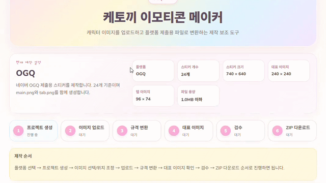
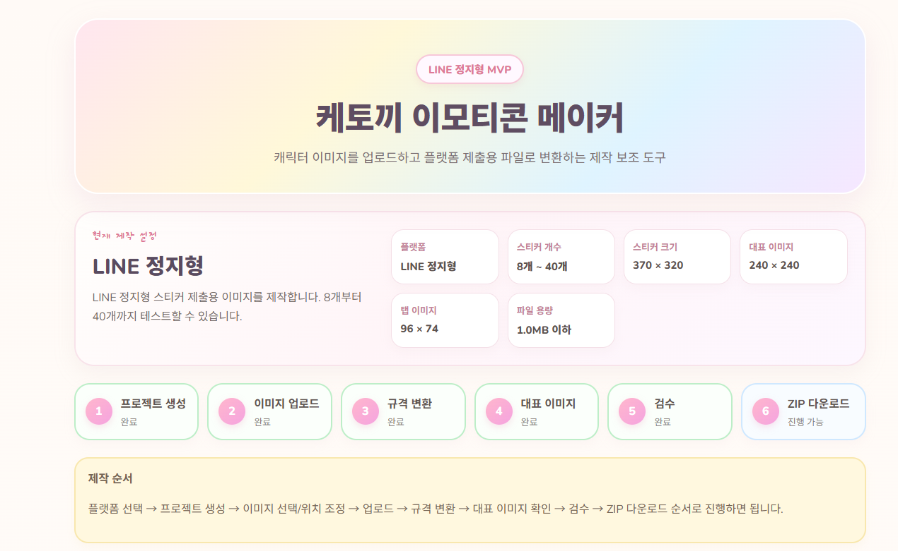
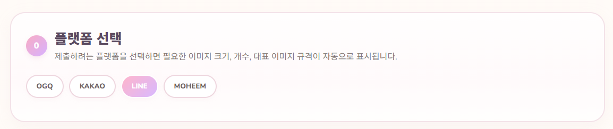
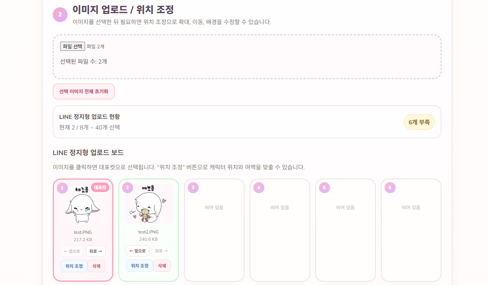
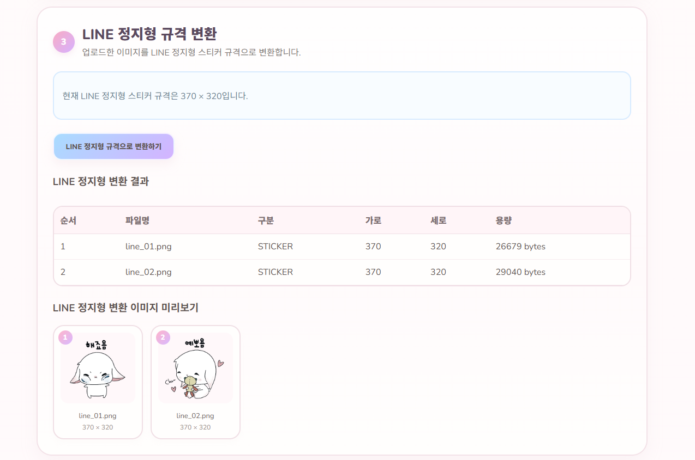
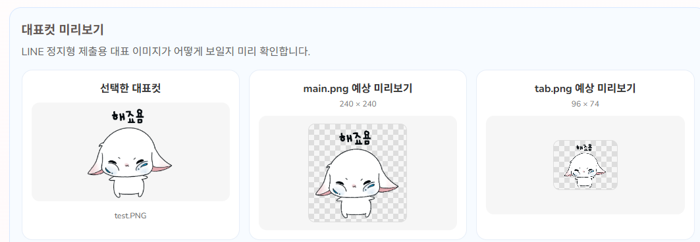
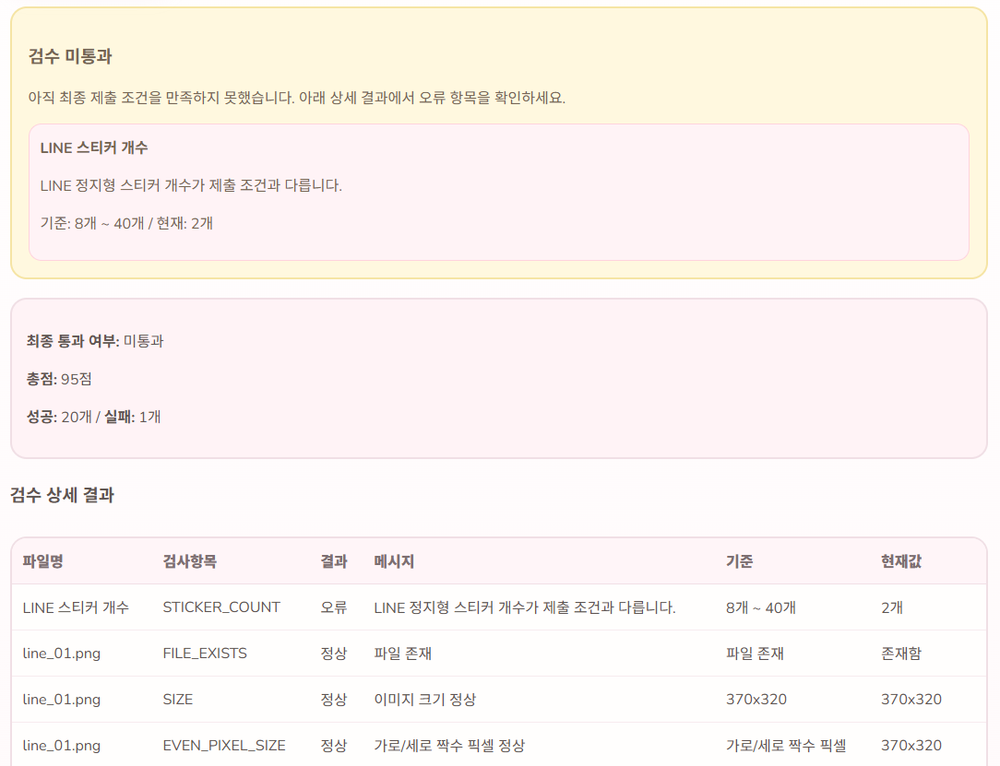
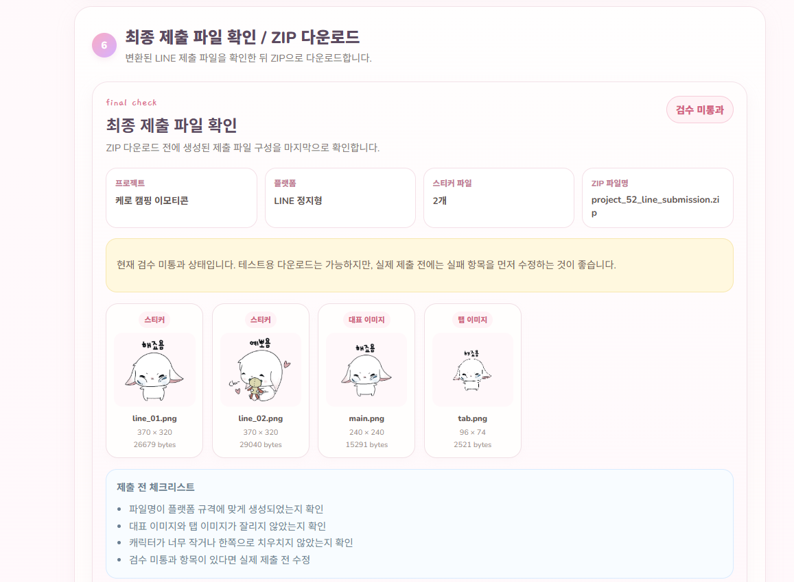
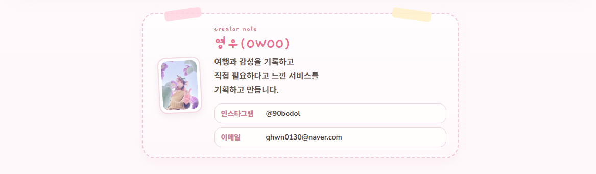

<div align="center">

<br />


# 🐰 케토끼 이모티콘 메이커

### AI 캐릭터 이미지를 플랫폼 제출용 이모티콘 파일로 변환하는 제작 보조 도구

<br />


<br />


<br />

> 캐릭터 이미지를 업로드하고, 플랫폼 제출 규격에 맞게 변환하고,  
> 대표 이미지 생성부터 검수, ZIP 다운로드까지 한 번에 진행할 수 있는 웹 서비스입니다.

<br />



<br />
<br />


<br />
<br />

</div>


---

## ✨ 프로젝트 한 줄 소개

**케토끼 이모티콘 메이커**는 AI로 만든 캐릭터 이미지나 직접 그린 이모티콘 이미지를  
**OGQ, KAKAO, LINE, MOHEEM** 등 플랫폼 제출 규격에 맞게 자동 변환해주는 제작 보조 도구입니다.

<br />

---

## 💡 만든 이유

AI 이미지 생성 도구를 사용하면 캐릭터 이미지는 쉽게 만들 수 있지만,  
실제 이모티콘 플랫폼에 제출하려면 다음과 같은 반복 작업이 필요합니다.

| 필요한 작업 | 불편했던 점 |
|---|---|
| 이미지 크기 조정 | 플랫폼마다 규격이 다름 |
| 대표 이미지 생성 | main.png, tab.png 등을 따로 만들어야 함 |
| 파일명 정리 | 제출용 파일명 규칙이 필요함 |
| 스티커 개수 확인 | 플랫폼마다 최소/최대 개수가 다름 |
| 위치/여백 조정 | 캐릭터가 한쪽으로 치우칠 수 있음 |
| 제출 전 검수 | 실제 제출 전에 오류를 확인해야 함 |
| ZIP 압축 | 최종 제출 파일을 한 번에 묶어야 함 |

<br />

그래서 이 프로젝트는  
**“이미지를 넣으면 플랫폼 제출용 파일로 정리해주는 도구”**를 목표로 만들었습니다.

<br />

---

## 🌷 주요 기능

<div align="center">

| Preview | Feature | Description |
|---|---|---|
| 🧁 | 플랫폼 선택 | OGQ, KAKAO, LINE, MOHEEM 규격을 선택할 수 있어요 |
| 🖼️ | 이미지 업로드 | 여러 장의 캐릭터 이미지를 한 번에 올릴 수 있어요 |
| 🎀 | 위치 조정 | 캐릭터 위치, 여백, 크기를 조정할 수 있어요 |
| 🪄 | 규격 변환 | 플랫폼별 제출 크기로 이미지를 자동 변환해요 |
| ⭐ | 대표컷 선택 | 대표 이미지로 사용할 컷을 직접 고를 수 있어요 |
| 🧸 | 대표 이미지 생성 | main.png, tab.png, 팩 대표 이미지를 만들어요 |
| 🔍 | 제출 전 검수 | 개수, 크기, 형식, 용량을 자동으로 확인해요 |
| 📦 | ZIP 다운로드 | 최종 제출 파일을 ZIP으로 다운로드해요 |

</div>

<br />

<div align="center">


</div>

<br />

---

## 🖥️ 화면 미리보기

### 1. 메인 화면

<div align="center">
  
</div>

<br />

### 2. 플랫폼 선택

<div align="center">
  
</div>

<br />

### 3. 이미지 업로드 보드

<div align="center">
  
</div>

<br />

### 4. 규격 변환 결과

<div align="center">
  
</div>

<br />

### 5. 대표컷 미리보기

<div align="center">
  
</div>

<br />

### 6. 검수 결과

<div align="center">
  
</div>

<br />

### 7. 최종 제출 파일 확인

<div align="center">
  
</div>

<br />

### 8. 제작자 카드

<div align="center">
  
</div>

<br />

---

## 🧩 지원 플랫폼 규격

| 플랫폼 | 스티커 개수 | 스티커 크기 | 대표 이미지 | 탭 이미지 |
|---|---:|---:|---:|---:|
| OGQ | 24개 | 740 × 640 | 240 × 240 | 96 × 74 |
| KAKAO | 32개 | 360 × 360 | 240 × 240 | 78 × 78 |
| LINE | 8개 ~ 40개 | 370 × 320 | 240 × 240 | 96 × 74 |
| MOHEEM 베이직팩 | 1개 ~ 23개 | 618 × 618 | 250 × 250 | 없음 |
| MOHEEM 플러스팩 | 24개 이상 | 618 × 618 | 250 × 250 | 없음 |

<br />

---

## 🧭 사용 흐름

<div align="center">

| Step | Flow |
|---:|---|
| 01 | 🧁 플랫폼 선택 |
| 02 | 📝 프로젝트 생성 |
| 03 | 🖼️ 이미지 업로드 |
| 04 | 🎀 이미지 위치 조정 |
| 05 | 🪄 플랫폼 규격 변환 |
| 06 | ⭐ 대표 이미지 생성 |
| 07 | 🔍 제출 전 검수 |
| 08 | 🧾 최종 제출 파일 확인 |
| 09 | 📦 ZIP 다운로드 |

</div>

<br />

---

## 🛠️ 기술 스택

### Frontend

| Tech | Role |
|---|---|
| React | 화면 구성 |
| Vite | 프론트엔드 개발 환경 |
| JavaScript | UI 로직 구현 |
| Fetch API | 백엔드 API 통신 |
| CSS in JS | 파스텔 감성 UI 스타일링 |

<br />

### Backend

| Tech | Role |
|---|---|
| Java | 백엔드 로직 구현 |
| Spring Boot | API 서버 구축 |
| Spring Web | REST API 구현 |
| Spring Data JPA | 데이터 저장 및 조회 |
| MySQL | 프로젝트/이미지 정보 저장 |
| Gradle | 빌드 관리 |

<br />

### Image Processing

| Feature | Role |
|---|---|
| ImageIO | 이미지 읽기/쓰기 |
| Resize | 플랫폼별 크기 변환 |
| PNG 변환 | 제출용 이미지 생성 |
| 대표 이미지 생성 | main.png, tab.png 생성 |
| ZIP 생성 | 최종 제출 파일 압축 |

<br />

---

## 📁 프로젝트 구조

```text
ketokki-sticker-maker
├─ backend
│  ├─ src/main/java
│  │  └─ com.ketokki.stickermaker
│  │     ├─ controller
│  │     ├─ service
│  │     ├─ repository
│  │     ├─ domain
│  │     └─ dto
│  └─ src/main/resources
│
└─ frontend
   └─ ketokki-emoticon-maker
      ├─ src
      │  ├─ App.jsx
      │  ├─ ImageCropEditor.jsx
      │  ├─ RepresentativePreview.jsx
      │  ├─ FinalSubmissionPreview.jsx
      │  ├─ index.css
      │  └─ assets
      └─ package.json
```

<br />

---

## 🚀 실행 방법

### 1. 백엔드 실행

백엔드 프로젝트를 실행합니다.

```bash
./gradlew bootRun
```

또는 IDE에서 아래 파일을 실행합니다.

```text
KetokkiStickerMakerApplication.java
```

백엔드 기본 주소:

```text
http://localhost:8080
```

플랫폼 규격 조회 테스트:

```bash
curl http://localhost:8080/api/platform-specs/OGQ
```

<br />

### 2. 프론트엔드 실행

프론트엔드 폴더로 이동합니다.

```bash
cd frontend/ketokki-emoticon-maker
```

패키지를 설치합니다.

```bash
npm install
```

개발 서버를 실행합니다.

```bash
npm run dev
```

프론트엔드 접속 주소:

```text
http://localhost:5173
```

<br />

---
